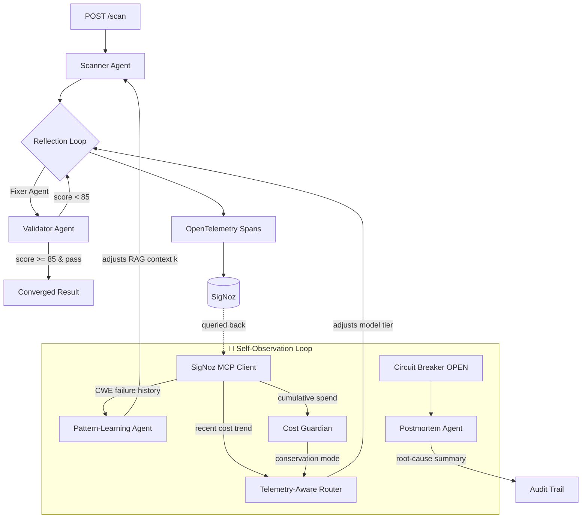

# 🛡️ DevGuard AI

**DevGuard doesn't just get observed — it observes itself, and adapts.**

An autonomous, self-healing AI security pipeline that scans code for vulnerabilities, fixes them through a Scanner → Fixer → Validator reflection loop, and — uniquely — **queries its own SigNoz telemetry (via MCP) to change its own runtime behavior**, not just to fill a dashboard for a human to read later.

Built for the [Agents of SigNoz](https://www.wemakedevs.org/hackathons/signoz) hackathon (OpenAI Agent Builder + SigNoz Observability tracks).

---

## The Problem

Manual security code review does not scale with commit velocity, and catches vulnerabilities *after* they're merged, not before. DevGuard AI turns that into an automated, self-verifying, fully-traced pipeline that runs in seconds, not hours — and unlike a typical LLM wrapper, it proves its own work: every fix is adversarially reviewed, retried until it passes a quality bar, hash-chained into an audit trail, and fully traced end-to-end in SigNoz.

## The Differentiator: Self-Observation

Every other AI-observability integration treats telemetry as something *recorded for humans* — dashboards, traces, alerts someone reads after the fact. DevGuard's agents read their **own** recent telemetry, live, in the same request path, and use it to change what they do next:



| Loop | Telemetry In | Decision Out |
|---|---|---|
| **Telemetry-Aware Router** | Recent 30-min LLM spend | Downgrades model tier under cost pressure — **never for `critical` severity**, a hard-coded safety floor |
| **Pattern-Learning Agent** | Historical Validator fail-rate per CWE | Elevates RAG retrieval depth (`k`) for CWE classes with a track record of needing more context |
| **Cost Guardian** | Cumulative session spend | Flips a global conservation-mode flag respected by the router |
| **Postmortem Agent** | The error burst that just tripped the circuit breaker | Writes a 2-3 sentence plain-English root cause the moment the breaker opens |

Every adaptation is: **(a)** returned in the API response as `self_observation`, so a human never has to dig through SigNoz to see it fired, and **(b)** stamped back onto the active span, so it's *also* visible inside SigNoz, right next to the scan it influenced. Fail-safe throughout: if SigNoz/MCP is slow or down, every one of these degrades to "behave exactly as if this layer didn't exist" — telemetry is an optimization, never a dependency the user-facing scan can fail on.

---

## Architecture

| Layer | Technology |
|---|---|
| Frontend | Next.js 14 (App Router), TypeScript, Tailwind, Framer Motion, Monaco Editor |
| Backend | FastAPI, Python 3.11, async throughout |
| AI Engine | Groq (Llama 3.3 70B / 3.1 8B — severity + telemetry-routed), swap point marked for GPT-5.6 |
| Vector Store | In-process CWE/OWASP RAG store |
| Observability | OpenTelemetry → SigNoz (self-hosted via SigNoz Foundry) |
| Resilience | Custom circuit breaker with fallback routing |
| Reproducibility | `casting.yaml` + `casting.yaml.lock` (Foundry) |

## Core Features

- **Multi-agent reflection loop** — Scanner → Fixer → Validator, up to 3 bounded retries, full history retained
- **Structured output everywhere** — every agent boundary is a strict Pydantic contract, no regex parsing
- **Severity-based + telemetry-aware model routing**
- **Full distributed tracing** — every agent, every reflection attempt, every self-observation decision is a span
- **Circuit breaker + graceful degradation** with an AI-generated postmortem the moment it trips
- **Hash-chained, tamper-evident audit trail**
- **Human-in-the-loop approval gate** for critical/high severity fixes
- **Accuracy benchmark harness** against labeled OWASP snippets (precision/recall/FPR)
- **Self-observing agent layer** (see above) — the core differentiator

## Quickstart (local)

```bash
git clone https://github.com/akashbichukale111/devguard-ai.git
cd devguard-ai
cp .env.example .env   # add your GROQ_API_KEY

# Backend
python -m venv venv && source venv/bin/activate
pip install -r requirements.txt
python -m uvicorn backend.main:app --reload --port 8000

# Frontend
cd frontend && npm install && npm run dev
```

Open `http://localhost:3000`, paste a vulnerable snippet, hit **Run DevGuard AI Agent**.

## SigNoz Usage

- **Traces** — the pipeline is instrumented so each scan emits one distributed trace (`devguard_pipeline → scanner_agent / fixer_agent / validator_agent`) plus self-observation spans, with logs bridged to the same trace via OpenTelemetry's `LoggingHandler`. **Not yet verified end to end against a running SigNoz instance** — see Limitations.
- **Dashboards** — `signoz/dashboard.json` is committed but has not been imported and verified against a live SigNoz.
- **Alerts** — `signoz/alerts.md` describes three intended rules. They are **not shipped**: as that file states, each depends on a metric that `telemetry.py` does not yet emit.
- **MCP** — `backend/core/mcp_client.py` provides a fail-safe client interface for the SigNoz MCP server. **It has not been verified against a real MCP server**: the transport and response shapes are unconfirmed (the file carries its own TODO). When the call path is unavailable the cost query falls back to an in-process estimate, which is reported as `data_source: "local_shadow"` — never as live telemetry.

## Reproducibility

Judges can re-run the exact SigNoz deployment used for this submission:
```bash
foundryctl cast -f casting.yaml
```
`casting.yaml.lock` pins the resolved configuration.

## Limitations

Stated plainly, because a claim a judge can disprove costs more than the feature was worth. Full detail in `docs/AUDIT.md`.

- **SigNoz has never been verified end to end.** Traces, the dashboard and the log↔trace bridge are implemented but unproven against a running instance. No screenshot of a real DevGuard trace exists yet.
- **The MCP self-observation path is unverified.** `mcp_client.py` targets an assumed HTTP transport; real MCP is JSON-RPC. Its default URL is not a SigNoz address. Treat the "agents query their own telemetry via MCP" idea as designed-and-stubbed, not demonstrated.
- **The Nexus god-mode endpoints run synthetically when called with an empty body**, which is what the UI currently sends. Panels badge every response with its real provenance (`LIVE` / `LOCAL` / `SIMULATED` / `PARTIAL`), so what you see is labelled honestly — but most of it is currently `SIMULATED`.
- **No test suite and no CI yet.**
- **Docker images do not build.** `backend/Dockerfile` copies files from outside its build context and there is no `frontend/Dockerfile`. Run the backend and frontend directly for now.
- **The benchmark harness has never been run to an artifact**, so no accuracy figures are published anywhere.
- **No `LICENSE` file yet.** One must be added before this is distributed.

## License

See `LICENSE`. **Not yet added — see Limitations.**
