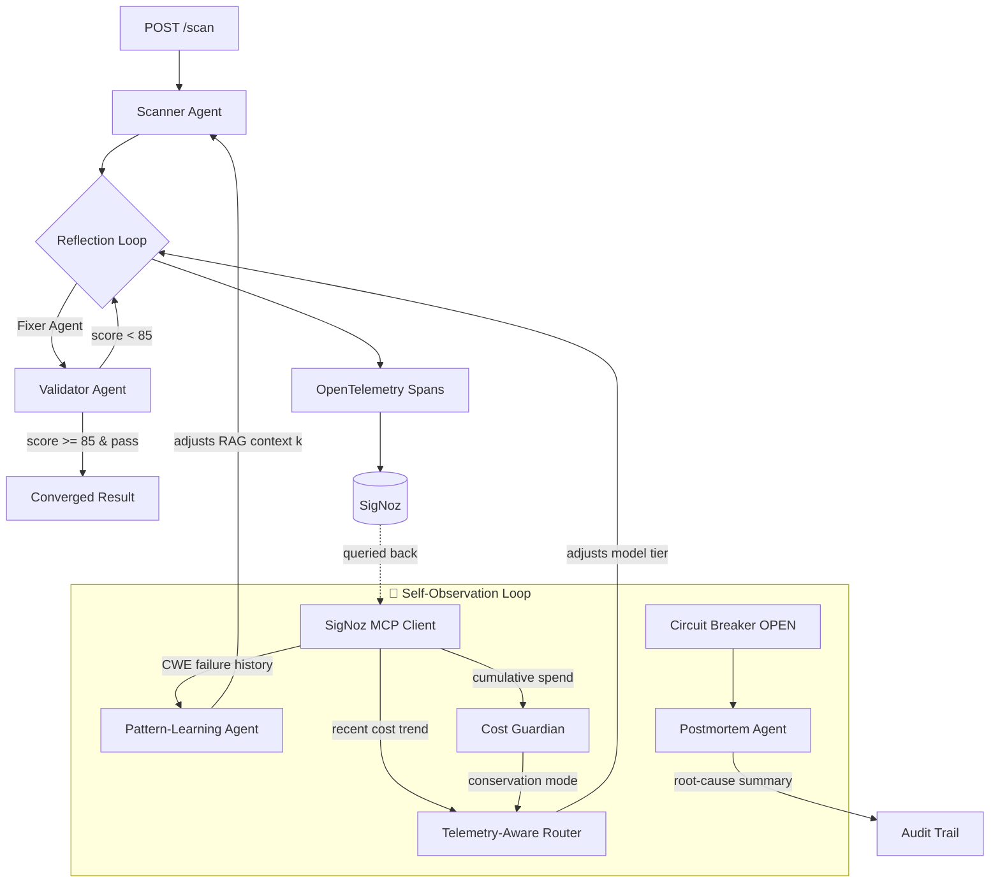

# 🛡️ DevGuard AI

[](https://github.com/akashbichukale111/devguard-ai/actions/workflows/ci.yml)

**DevGuard doesn't just get observed — it observes itself, and adapts.**

An autonomous, self-healing AI security pipeline that scans code for vulnerabilities, fixes them through a Scanner → Fixer → Validator reflection loop, and feeds its own telemetry back into its next decision — model tier, retrieval depth, spend ceiling — rather than only recording it for a human to read later.

> **Read this before the pitch below.** The self-observation loop currently reads
> an **in-process** telemetry shadow, not SigNoz. The MCP client that would query
> SigNoz itself has never completed a round trip against a real server, so
> "queries its own SigNoz telemetry via MCP" is a design, not a demonstrated
> capability — see [Limitations](#limitations) and `docs/MCP_DECISION.md`. Every
> adaptation described below does fire, and is labelled with its real data
> source in the API response and the UI.

Built for the [Agents of SigNoz](https://www.wemakedevs.org/hackathons/signoz) hackathon (OpenAI Agent Builder + SigNoz Observability tracks).

---

## The Problem

Manual security code review does not scale with commit velocity, and catches vulnerabilities *after* they're merged, not before. DevGuard AI turns that into an automated, self-verifying, fully-traced pipeline that runs in seconds, not hours — and unlike a typical LLM wrapper, it proves its own work: every fix is adversarially reviewed, retried until it passes a quality bar, hash-chained into an audit trail, and fully traced end-to-end in SigNoz.

## The Differentiator: Self-Observation

Every other AI-observability integration treats telemetry as something *recorded for humans* — dashboards, traces, alerts someone reads after the fact. DevGuard's agents read their **own** recent telemetry, live, in the same request path, and use it to change what they do next. In the diagram below, the dashed `queried back` edge from SigNoz is the **unverified** part; the loops themselves run off `backend/core/local_telemetry.py`.



| Loop | Telemetry In | Decision Out |
|---|---|---|
| **Telemetry-Aware Router** | Recent 30-min LLM spend | Downgrades model tier under cost pressure — **never for `critical` severity**, a hard-coded safety floor. Enforced by parsing through the `Severity` enum and failing safe on anything it cannot parse; 31 tests in `tests/test_adaptive_routing_floor.py`, including that non-critical severities *are* still downgradable so the floor cannot be "fixed" by disabling cost control |
| **Pattern-Learning Agent** | Historical Validator fail-rate per CWE | Elevates RAG retrieval depth (`k`) for CWE classes with a track record of needing more context |
| **Cost Guardian** | Cumulative session spend | Flips a global conservation-mode flag respected by the router |
| **Postmortem Agent** | The error burst that just tripped the circuit breaker | Writes a 2-3 sentence plain-English root cause the moment the breaker opens |

Every adaptation is: **(a)** returned in the API response as `self_observation`, so a human never has to dig through SigNoz to see it fired, and **(b)** stamped back onto the active span, so it's *also* visible inside SigNoz, right next to the scan it influenced. Fail-safe throughout: if SigNoz/MCP is slow or down, every one of these degrades to "behave exactly as if this layer didn't exist" — telemetry is an optimization, never a dependency the user-facing scan can fail on.

---

## Architecture

| Layer | Technology |
|---|---|
| Frontend | Next.js 14 (App Router), TypeScript, Tailwind, Framer Motion, Monaco Editor |
| Backend | FastAPI, Python 3.11, async throughout |
| AI Engine | Groq (Llama 3.3 70B / 3.1 8B — severity + telemetry-routed), swap point marked for GPT-5.6 |
| Vector Store | In-process CWE/OWASP RAG store |
| Observability | OpenTelemetry (traces, metrics, logs) exporting OTLP/gRPC — verified against a local collector, **not** yet against SigNoz |
| Resilience | Custom circuit breaker with fallback routing |

## Core Features

- **Multi-agent reflection loop** — Scanner → Fixer → Validator, up to 3 bounded retries, full history retained
- **Structured output everywhere** — every agent boundary is a strict Pydantic contract, no regex parsing
- **Severity-based + telemetry-aware model routing**
- **Full distributed tracing** — every agent, every reflection attempt, every self-observation decision is a span
- **Circuit breaker + graceful degradation** with an AI-generated postmortem the moment it trips
- **Hash-chained, tamper-evident audit trail**
- **Human-in-the-loop approval gate** for critical/high severity fixes
- **Accuracy benchmark harness** against labeled OWASP snippets (precision/recall/FPR)
- **Self-observing agent layer** (see above) — the core differentiator

## Quickstart (local)

```bash
git clone https://github.com/akashbichukale111/devguard-ai.git
cd devguard-ai
cp .env.example .env   # add your GROQ_API_KEY

# Backend
python -m venv venv && source venv/bin/activate
pip install -r requirements.txt
python -m uvicorn backend.main:app --reload --port 8000

# Frontend
cd frontend && npm install && npm run dev
```

Open `http://localhost:3000`, paste a vulnerable snippet, hit **Run DevGuard AI Agent**.

## SigNoz Usage

- **Traces** — the pipeline is instrumented so each scan emits one distributed trace (`devguard_pipeline → scanner_agent / fixer_agent / validator_agent`) plus self-observation spans, with logs bridged to the same trace via OpenTelemetry's `LoggingHandler`. **Not yet verified end to end against a running SigNoz instance** — see Limitations.
- **Dashboards** — `signoz/dashboard.json` is committed but has not been imported and verified against a live SigNoz.
- **Alerts** — `signoz/alerts.md` describes three intended rules. They are **not shipped**: as that file states, each depends on a metric that `telemetry.py` does not yet emit.
- **MCP** — `backend/core/mcp_client.py` provides a fail-safe client interface for the SigNoz MCP server. **It has not been verified against a real MCP server**: the transport and response shapes are unconfirmed (the file carries its own TODO). When the call path is unavailable the cost query falls back to an in-process estimate, which is reported as `data_source: "local_shadow"` — never as live telemetry.

## Reproducibility

**What is verified and reproducible today**, on a clean checkout with no
container registry and no API key:

```bash
make doctor          # reports exactly what is present and what is missing
make test            # the test suite (no key, no collector, no network)
python scripts/verify_otel.py    # boots the real app, asserts decoded OTLP
```

`scripts/verify_otel.py` stands up an in-process OTLP/gRPC receiver, starts a
real uvicorn, drives traffic through it and asserts against the decoded
protobuf — so the telemetry pipeline is proven end to end without SigNoz. Its
output is in `docs/audit-evidence/t2/otel-verification.json`.

**What is not reproducible yet.** `casting.yaml` and `casting.yaml.lock` (SigNoz
Foundry) are committed, but no SigNoz deployment has ever been stood up from
them — `foundryctl` is not installed here and image pulls are blocked
(`docs/audit-evidence/t2/registry-egress-diagnosis.txt`). This section
previously read *"Judges can re-run the exact SigNoz deployment used for this
submission"*; there is no such deployment to re-run. Treat those two files as an
untested deployment plan. To point DevGuard at a SigNoz you already run, set
`OTEL_EXPORTER_OTLP_ENDPOINT` — see `DEPLOYMENT.md` §2.

## Limitations

Stated plainly, because a claim a judge can disprove costs more than the feature was worth. Full detail in `docs/AUDIT.md`.

- **SigNoz has never been verified end to end.** Traces, the dashboard and the log↔trace bridge are implemented but unproven against a running instance. No screenshot of a real DevGuard trace exists yet.
- **The MCP self-observation path is unverified.** `mcp_client.py` targets an assumed HTTP transport; real MCP is JSON-RPC. Its default URL is not a SigNoz address. Treat the "agents query their own telemetry via MCP" idea as designed-and-stubbed, not demonstrated.
- **The Nexus god-mode endpoints run synthetically when called with an empty body**, which is what the UI currently sends. Panels badge every response with its real provenance (`LIVE` / `LOCAL` / `SIMULATED` / `PARTIAL`), so what you see is labelled honestly — but most of it is currently `SIMULATED`.
- **The Docker path does not work yet** — `backend/Dockerfile` copies files from
  outside its build context and there is no `frontend/Dockerfile`. Run the
  backend and frontend directly (see Quickstart). Fixing this needs container
  registry access, which is currently blocked; evidence in
  `docs/audit-evidence/t2/registry-egress-block.txt`.
- **The benchmark harness has never been run to an artifact**, so no accuracy
  figures are published anywhere. The result page shows "accuracy not measured"
  until one exists. To produce one you need a working `GROQ_API_KEY`:
  ```bash
  python -m backend.core.benchmark --json data/benchmark_report.json
  ```
  That artifact is the **only** route by which a number reaches the API or the
  UI — nothing is hard-coded at either end, and the harness refuses to write it
  if any scan errored (pass `--allow-errored` to override).
- **Test coverage is real but partial.** 181 tests run in CI on every push, with
  no API key, no collector and no network: schema contracts, audit chain
  tamper-detection, the paginated audit read, circuit breaker, telemetry
  fail-safety, the prompt-injection boundary, RAG determinism, the benchmark
  harness, the reflection loop's control flow, and the `/scan` response contract.
  The reflection loop's **orchestration** is covered end to end with the three
  agent calls monkeypatched — convergence, retry threading, exhaustion, the
  clean-code short-circuit. What is **not** covered is the models' own judgement:
  no scan has ever run against a live LLM, so nothing here measures whether the
  Scanner finds real vulnerabilities or the Fixer writes correct patches.
- **No `LICENSE` file yet.** One must be added before this is distributed.

## License

See `LICENSE`. **Not yet added — see Limitations.**
