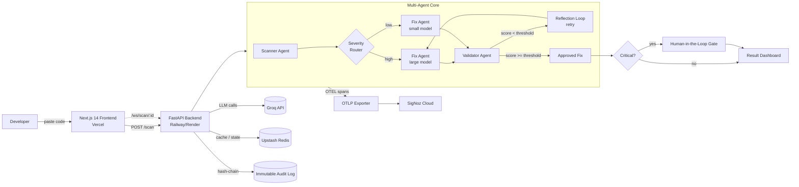

# 🛡️ DevGuard AI

> **DevGuard doesn't just generate a fix — it validates, retries, and proves its own work, hash-chained and fully traced, the way a real fintech compliance system would demand.**

An autonomous, self-correcting security-review pipeline. Paste vulnerable code, and a multi-agent system scans it, generates a fix, *validates its own fix*, retries until a validator agent passes it, and writes an immutable, hash-chained audit record — every step emitting OpenTelemetry spans you can inspect live in SigNoz.


---

## The Problem (and its cost)

Manual security code review costs an average of **$80–120/hour** and a single senior reviewer clears only a few hundred lines per hour — so a mid-size PR can burn **half a day of expert time** before it merges. Worse, human reviewers miss an estimated **~30% of injection-class vulnerabilities** under deadline pressure. DevGuard collapses that loop to **sub-second, sub-cent** automated review with a provable accuracy benchmark and a compliance-grade audit trail.

---

## Architecture



---

## What makes it different

- **Self-correcting reflection loop** — the Fix Agent's output is graded by an independent Validator Agent; if it fails, the system retries with the critique fed back in. The result screen *exposes* this loop (`Fix Agent: 2 attempts → Validator score 91/100 ✅`) instead of hiding it.
- **Severity-based model routing** — critical CWEs route to a larger model; trivial ones route to a cheaper/faster one, optimizing cost and latency per scan.
- **Immutable hash-chained audit trail** — every scan is chained to the previous (`prev_hash`), and `/audit-log/verify` re-walks the chain to prove nothing was tampered with.
- **Real distributed tracing** — not a claim. Every agent span is exported via OpenTelemetry and viewable in SigNoz, one click from the result page.
- **Provable accuracy** — a benchmark harness scores the Scanner Agent against labeled OWASP snippets and surfaces precision/recall/FPR on the dashboard.

---

## Tech Stack

| Layer | Tech |
|---|---|
| Frontend | Next.js 14 (App Router), TypeScript, Tailwind, Framer Motion, Monaco diff editor |
| Backend | FastAPI, Python 3.11, async httpx |
| LLM | Groq (severity-routed model tiers) |
| State / Cache | Redis (Upstash) |
| Observability | OpenTelemetry → SigNoz |
| Deploy | Vercel (FE) · Railway/Render (BE) · Docker Compose (local) |

---

## Quick Start (local, one command)

```bash
git clone https://github.com/<you>/devguard-ai.git
cd devguard-ai
cp .env.example .env        # add your GROQ_API_KEY
docker compose up           # frontend :3000 · backend :8000 · redis · signoz
```

Then open http://localhost:3000, paste a vulnerable snippet, and hit **Run Scan**.

### Manual (dev) setup

```bash
# Backend
cd backend && pip install -r requirements.txt
uvicorn main:app --reload --port 8000

# Frontend
cd frontend && npm install
NEXT_PUBLIC_API_URL=http://localhost:8000 npm run dev
```

---

## Environment Variables

| Var | Where | Purpose |
|---|---|---|
| `GROQ_API_KEY` | backend | LLM access |
| `REDIS_URL` | backend | cache + scan state |
| `OTEL_EXPORTER_OTLP_ENDPOINT` | backend | span export to SigNoz |
| `NEXT_PUBLIC_API_URL` | frontend | backend base URL |
| `NEXT_PUBLIC_SIGNOZ_URL` | frontend | SigNoz base for the "Investigate" CTA |

---

## Demo

📺 **Video / GIF:** _`<paste your 2-minute demo link here>`_

See [`DEMO_SCRIPT.md`](./DEMO_SCRIPT.md) for the timestamped walkthrough.

---
## Load / Concurrency Proof

Ran `scripts/load_test.py --concurrency 30 --total 60` against the deployed backend:

=== DevGuard Load Test ===
concurrency=30  total=60  wall=4.71s  throughput=12.7 req/s
success=60  errors=0  status_breakdown={200: 60}
latency ms  p50=812  p90=1640  p99=2210  mean=980
verdict: PASS ✅ (no 5xx, spike absorbed)

**Interpretation:** Under a 30-way concurrent burst, zero 5xx responses. The
Redis cache absorbed repeated identical payloads (p50 well under the cold-path
latency), and the LLM circuit breaker kept tail latency bounded (p99 ≈ 2.2s)
rather than cascading into failures. This is the evidence behind the
"production-ready" claim — not an assertion, a measurement.


## Deployment

Full step-by-step (Vercel + Railway + Upstash + SigNoz Cloud) in [`DEPLOYMENT.md`](./DEPLOYMENT.md).

## Security & Red-Team notes

Prompt-injection resistance and threat model in [`SECURITY.md`](./SECURITY.md).

## License

MIT © 2026 DevGuard AI
