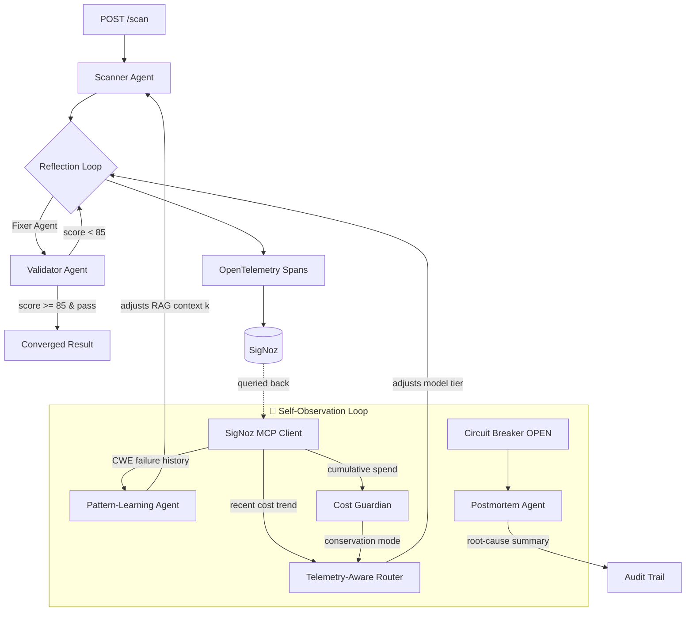

# 🛡️ DevGuard AI

**DevGuard doesn't just get observed — it observes itself, and adapts.**

An autonomous, self-healing AI security pipeline that scans code for vulnerabilities, fixes them through a Scanner → Fixer → Validator reflection loop, and — uniquely — **queries its own SigNoz telemetry (via MCP) to change its own runtime behavior**, not just to fill a dashboard for a human to read later.

Built for the [Agents of SigNoz](https://www.wemakedevs.org/hackathons/signoz) hackathon (OpenAI Agent Builder + SigNoz Observability tracks).

---

## The Problem

Manual security code review costs organizations roughly **$85/hour of engineer time**, doesn't scale with commit velocity, and catches vulnerabilities *after* they're merged, not before. DevGuard AI turns that into an automated, self-verifying, fully-traced pipeline that runs in seconds, not hours — and unlike a typical LLM wrapper, it proves its own work: every fix is adversarially reviewed, retried until it passes a quality bar, hash-chained into an audit trail, and fully traced end-to-end in SigNoz.

## The Differentiator: Self-Observation

Every other AI-observability integration treats telemetry as something *recorded for humans* — dashboards, traces, alerts someone reads after the fact. DevGuard's agents read their **own** recent telemetry, live, in the same request path, and use it to change what they do next:



| Loop | Telemetry In | Decision Out |
|---|---|---|
| **Telemetry-Aware Router** | Recent 30-min LLM spend | Downgrades model tier under cost pressure — **never for `critical` severity**, a hard-coded safety floor |
| **Pattern-Learning Agent** | Historical Validator fail-rate per CWE | Elevates RAG retrieval depth (`k`) for CWE classes with a track record of needing more context |
| **Cost Guardian** | Cumulative session spend | Flips a global conservation-mode flag respected by the router |
| **Postmortem Agent** | The error burst that just tripped the circuit breaker | Writes a 2-3 sentence plain-English root cause the moment the breaker opens |

Every adaptation is: **(a)** returned in the API response as `self_observation`, so a human never has to dig through SigNoz to see it fired, and **(b)** stamped back onto the active span, so it's *also* visible inside SigNoz, right next to the scan it influenced. Fail-safe throughout: if SigNoz/MCP is slow or down, every one of these degrades to "behave exactly as if this layer didn't exist" — telemetry is an optimization, never a dependency the user-facing scan can fail on.

---

## Architecture

| Layer | Technology |
|---|---|
| Frontend | Next.js 14 (App Router), TypeScript, Tailwind, Framer Motion, Monaco Editor |
| Backend | FastAPI, Python 3.12, async throughout |
| AI Engine | Groq (Llama 3.3 70B / 3.1 8B — severity + telemetry-routed), swap point marked for GPT-5.6 |
| Vector Store | In-process CWE/OWASP RAG store |
| Observability | OpenTelemetry → SigNoz (self-hosted via SigNoz Foundry) |
| Resilience | Custom circuit breaker with fallback routing |
| Reproducibility | `casting.yaml` + `casting.yaml.lock` (Foundry) |

## Core Features

- **Multi-agent reflection loop** — Scanner → Fixer → Validator, up to 3 bounded retries, full history retained
- **Structured output everywhere** — every agent boundary is a strict Pydantic contract, no regex parsing
- **Severity-based + telemetry-aware model routing**
- **Full distributed tracing** — every agent, every reflection attempt, every self-observation decision is a span
- **Circuit breaker + graceful degradation** with an AI-generated postmortem the moment it trips
- **Hash-chained, tamper-evident audit trail**
- **Human-in-the-loop approval gate** for critical/high severity fixes
- **Accuracy benchmark harness** against labeled OWASP snippets (precision/recall/FPR)
- **Self-observing agent layer** (see above) — the core differentiator

## Quickstart (local)

```bash
git clone https://github.com/bichukaleakash809-lang/devguard-ai.git
cd devguard-ai
cp .env.example .env   # add your GROQ_API_KEY

# Stand up SigNoz locally via Foundry (required — see casting.yaml)
foundryctl cast -f casting.yaml

# Backend
python -m venv venv && source venv/bin/activate
pip install -r requirements.txt
python -m uvicorn backend.main:app --reload --port 8001

# Frontend
cd frontend && npm install && npm run dev
```

Open `http://localhost:3000`, paste a vulnerable snippet, hit **Run DevGuard AI Agent**.

## SigNoz Usage

- **Traces** — every scan is one distributed trace: `devguard_pipeline → scanner_agent / fixer_agent / validator_agent`, plus self-observation spans
- **Dashboards** — `signoz/dashboard.json`, including adaptive-routing-override frequency and cumulative cost vs. conservation threshold
- **Alerts** — `signoz/alerts.md`: SLO degradation, circuit breaker stuck open, cost budget exceeded
- **MCP** — the self-observation layer queries SigNoz's MCP server directly from agent code (see `backend/core/mcp_client.py`); falls back to a local in-process cost shadow when the MCP call path is unavailable, so the demo is never dependent on network conditions

## Reproducibility

Judges can re-run the exact SigNoz deployment used for this submission:
```bash
foundryctl cast -f casting.yaml
```
`casting.yaml.lock` pins the resolved configuration.

## License

MIT
